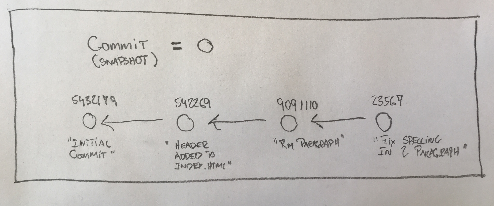

<!-- JS use if these pages are used as githubpages. can be deleted if used elsewhere -->
<script src="https://code.jquery.com/jquery-3.2.1.min.js"></script>
<script src="../script.js"></script> 


# Git basic datamodeløvelse

Lav en ny mappe, med en enkelt fil "index.html" og copy/paste dette indhold ind i filen.

````
	
<!DOCTYPE html>
<html lang="en-US">
  <head>
    <meta charset="UTF-8">

  </head>
  <body>

<h1 id="versionsstyrring-git">Versionsstyrring (Git)</h1>

<p></p>

<h2 id="læringsmål">Læringsmål</h2>
<p>Efter denne uges undervisning, læsning og øvelser kan du:</p>
<ul>
  <li>Forstå Gits Datamodel</li>
  <li>Gøre brug af basic kommandoer og relaterer dem til gits datamodel:
    <ul>
      <li>git help <command />: get help for a git command</li>
      <li>git init: creates a new git repo, with data stored in the .git directory</li>
      <li>git status: tells you what’s going on</li>
      <li>git add <filename>: adds files to staging area</filename></li>
      <li>git commit: creates a new commit</li>
      <li>git log: shows a flattened log of history</li>
      <li>git log –all –graph –decorate: visualizes history as a DAG</li>
      <li>git checkout <revision>: updates HEAD and current branch</revision></li>
      <li>git clone: download repository from remote</li>
    </ul>
  </li>
  <li>Skrive gode og forståelige commit message</li>
</ul>

<h2 id="materialer">Materialer</h2>
<ul>
  <li><a href="https://git-scm.com/book/en/v2">Git Pro (kap 1 og 2)</a></li>
  <li><a href="/e21/materialer/git_datamodel.html">Git’s data model</a></li>
  <li><a href="https://chris.beams.io/posts/git-commit/">How to Write a Git Commit Message</a></li>
</ul>

<h2 id="øvelser">Øvelser</h2>
<ul>
  <li><a href="/e21/materialer/tree_exercise.html">The tree command line tool</a></li>
</ul>


      <footer class="site-footer">
        
      </footer>
    </main>
  </body>
</html>


````

Åben denne fil i din browser. 

Brug nu de kommandoer vi lige har været igennem. 

* Git init (for at oprette et ny git repository)
* Git add (for at tilføje filer til dit "staging area")
* git Commit (for at lave et "snapshot")
* git status
* git log ---all ---graph ---decorate

Og tegn en "commit graf" med id´er og commit messages for dit projekt (eksempel herunder).



Meningen med denne øvelse er at du får leget med git, og får lavet en masse commits.

## Del 2
Brug nu kommandoen ```` git checkout <commitid> ```` for at gå frem og tilbage i din git historik. Sørg for at du ved hvor du er i forhold til den commit graf du har tegnet tidligere.

Kig på koden i intelliJ og åben filen i browseren og se hvad der sker når du hopper frem og tilbage i historikken.  

## Del 3
Opret et Spring Boot projekt som i har gjort i programmeringsundervisningen.    
Brug ```` git init ```` for at initialisere det som et git repository.    
Brug de samme kommandoer som i øvelse 1 på dette projekt:

* Git init (for at oprette et ny git repository)
* Git add (for at tilføje filer til dit "staging area")
* git Commit (for at lave et "snapshot")
* git status
* git log ---all ---graph ---decorate

Til dette projekt skal du også tegne en "Commit Graph":


Og du skal bruge commandoen ```` checkout ```` til at gå frem og tilbage i dine commits.


## Del 4
**Gentag alt dette 1000 gange inden vi mødes igen.**
