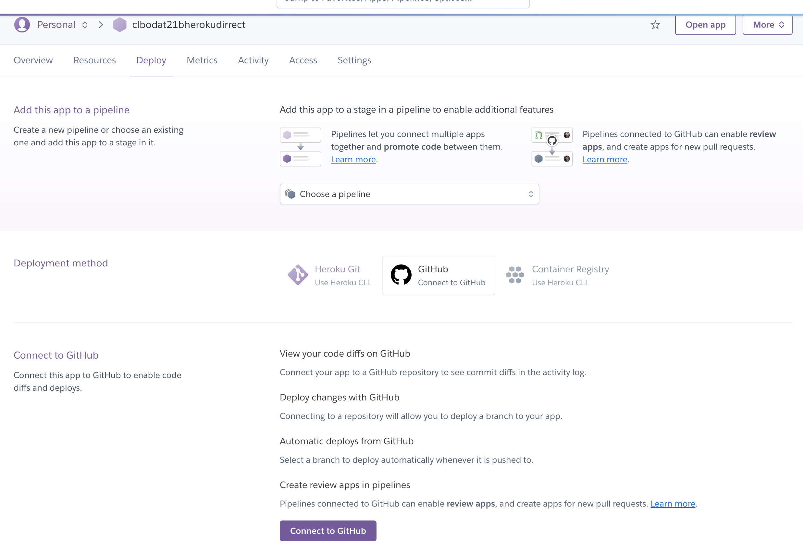
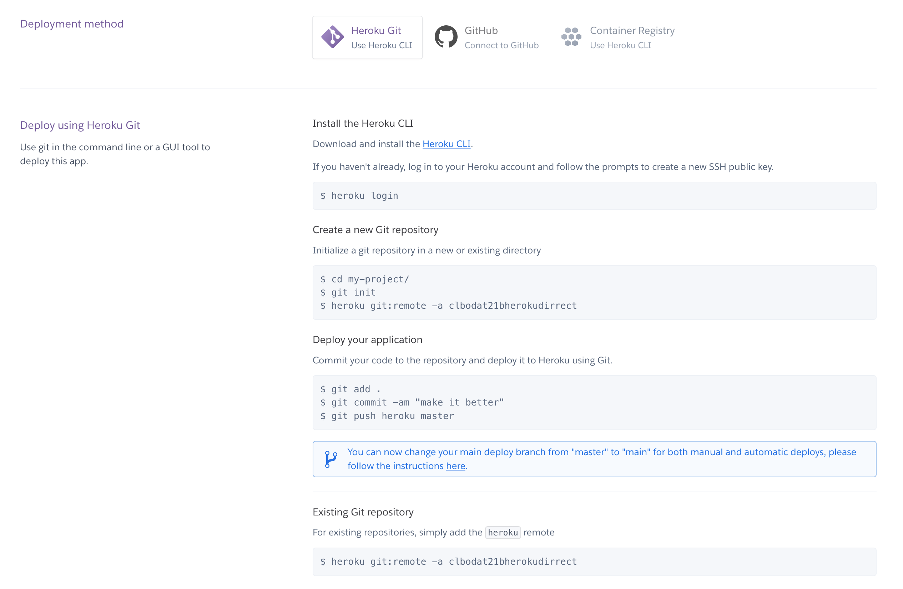

<!-- JS use if these pages are used as githubpages. can be deleted if used elsewhere -->
<script src="https://code.jquery.com/jquery-3.2.1.min.js"></script>
<script src="../script.js"></script> 

# Deployment med Heroku CLI (Command Line Interface)

Den deploymentmetode som vi har arbejdet med i timerne virker desværre ikke for tiden, da [github er blevet hacket](https://status.heroku.com/), men så gør vi det bare på en anden måde.
Det følgende er en beskrivelse af hvordan i gør det. 


Tidligere har i brugt "github deployment metoden" hvor i pusher jeres kode til github og så forbinder dette repository med Heroku.



Nu skal i bruge Heroku CLI metoden til at deploye jeres applikation. 



Metoden er "straight forward", så bare følg beskrivelserne. 


I praksis kommer i til at forbinde jeres lokale repository med både github og med heroku.

I vil kunne se det ved at skrive:

````
	$ git remote -v
	heroku	https://git.heroku.com/clbodat21bherokudirrect.git (fetch)
	heroku	https://git.heroku.com/clbodat21bherokudirrect.git (push)
	origin	https://github.com/techkea/webshopdat21b.git (fetch)
	origin	https://github.com/techkea/webshopdat21b.git (push)

````
Og hvis i skal pushe til github gør i som normalt:

````
	$ git push origin master
````

Hvis i skal pushe det til Heroku:

````
	$ git push heroku master
````


